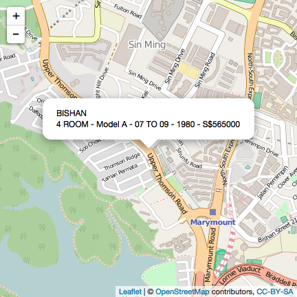

--- 
title       : Pricing guide
subtitle    : Choosing a public housing flat in Singapore 
author      : Jean-Michel Coeur, July 2016
job         : Coursera "Data Product" Course
framework   : io2012        # {io2012, html5slides, shower, dzslides, ...}
highlighter : highlight.js  # {highlight.js, prettify, highlight}
hitheme     : solarized_light # 
widgets     : []            # {mathjax, quiz, bootstrap}
mode        : selfcontained # {standalone, draft}
knit        : slidify::knit2slides
--- 

<style type="text/css">
body {
background:white;
}
</style>

## 1. Choosing a public housing flat in Singapore

1. Singapore has had an extensive public housing program since its inception in 1960, managed by the Housing Development Board (HDB). 
  - 1+ millions flats, split between 23 HDB towns and 3 estates. 
  - Any HDB flat can be sold on the reseller market after 5 years of occupancy.

2. This application predicts the price of a public housing flat on the reseller market. Price is based on:
  - Location within Singapore: HDB town, 
  - The type of the flat: 2 Rooms, 5 rooms ...,
  - The flat model: standard, improved...
  - The storeys range: "07 TO 09", "10 TO 12" etc...,
  - Year when the lease started: all HDB flats have a 99 years lease at time of initial construction

3. The price prediction algorithm is using a Linear Model
  - Model built with the [Singapore Housing Development Board (HDB) Resale price dataset ](https://data.gov.sg/dataset/resale-flat-prices/resource/83b2fc37-ce8c-4df4-968b-370fd818138b).
  - Dataset includes 40,000 flats transations on the reseller market from 2014 o 2016, during which prices have ben relatively stable.

4. This application has been built with [Shiny](http://shiny.rstudio.com/), a Web application framework for R.

5. Online application is available at [HDB Flat Price App](ttps://jmdaniel.shinyapps.io/HDBFlatPriceApp/)

--- &twocol .codefontsmall .codemargin .outmargin 

## 2. Building Linear Model

*** =left
Construction of the Linear model:

```r
fit_lmSimple <- lm(formula = resale_price ~ town + 
            flat_model * lease_start_date + flat_type + storey_range, 
            data = training)
```
Most important predictors:


```r
head(imp[order(imp$MeanGini, decreasing = TRUE), ], 4)
```

```
##                  ind MeanGini
## 19     townSEMBAWANG 67.26240
## 24     townWOODLANDS 66.36567
## 8  townCHOA CHU KANG 65.35519
## 20      townSENGKANG 61.06183
```
The resale price of a flat depends mostly on (decreasing order):
  - Location : HDB town
  - Number of years left of the lease
  - Type of appartment
  - Floor level

*** =right

Adjusted R squared of the linear model:

```
## [1] 0.828
```
The price prediction will be carried with a 95% confidence interval.
Prediction of 3 ROOM flat, model A, floor "07 TO 09" in ANG MO KIO, with lease starting in 1995:


```r
ndata <- c("ANG MO KIO","3 ROOM", "Model A", "07 TO 09", 1995)
new_pred <- predict_price(fit_model, ndata)
new_pred$Price <- as.character(round(new_pred$Price / 1000, 0) * 1000)
new_pred$Lower <- as.character(round(new_pred$Lower / 1000, 0) * 1000)
new_pred$Upper <- as.character(round(new_pred$Upper / 1000, 0) * 1000)
new_pred
```

```
##         town flat_type flat_model storey_range lease_start_date  Price
## 1 ANG MO KIO    3 ROOM    Model A     07 TO 09             1995 414000
##    Lower  Upper
## 1 410000 418000
```

--- &twocol2 .codefont .codemargin .outmargin 

## 3. Shiny User Interface

*** =left
The application User Interface reflects the important predictors that have been identified by the statistical model.


*** =right 
To compute the resale price, we use a reactive variable, which is triggered when the user clicks on "Compute resale price":


```r
  # Predict the price using a reactive variable 
  prediction <- eventReactive(input$compute, {
    # Gather the input data
    ndata <- c(input$towns, input$types, input$models, 
               input$storeys, input$start_year_lease)
    
    # Predict the price using the Linear model
    new_pred <- predict_price(fit_model, ndata)
    
    # We add the new prediction to the previous one 
    # WITHOUT resetting the dataframe: use f "<<-"
    price_table <<- rbind(price_table, new_pred)
  })

  # Display the updated table with all predictions
  output$oselection <- renderTable ({prediction()})
```
The price is added to the price table and displayed. 

--- &twocol2 .codefont .codemargin2 .outmargin2

## 4. Plotting predicted prices


*** =left 

When the user selects the tab "Flats on Singapore's map", the flat location is displayed with its characteristic and its indicative price. 
  - We use a Leaflet object to draw the Singapore map with the coordinates of the HDB towns. 
  - Example with a predicted price for a 4 ROOM flat with lease starting in 1980 in the HDB town "Bishan":

This map displays all HDB towns from the generated price table, with all selected flats.


Example of a recent HDB flat program: Pinnacle @ Duxton.


Thank you for reading this presentation.


*** =right





